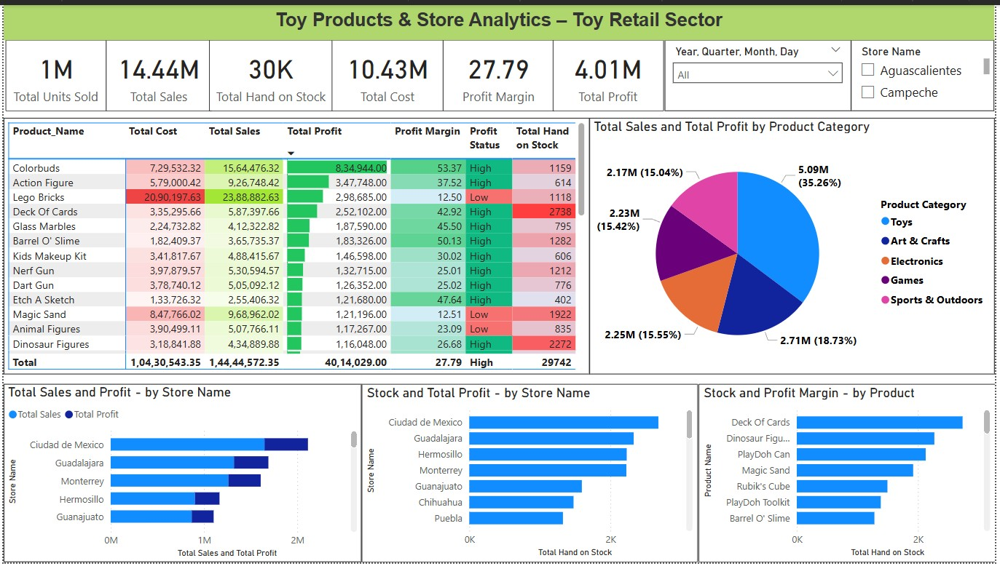

# 📊 Business Performance Analysis of Toy Products Across Stores in Mexico

### 📌 Project Overview:
- This project focuses on analyzing a toy business operating across multiple stores in Mexico, selling a wide variety of toy products. The aim is to uncover insights about product sales, profitability, and inventory usage, using Power BI and Python.

### 🎯 Problem Statement:
The business faced key challenges such as:
- Overstocking of underperforming products
- Unbalanced sales across product categories
- Underutilized high-margin items
- Understand Products with high profit margins but low sales volum
- Inventory inefficiencies (e.g: high stock but low sales)

### To tackle these, the analysis spans across stores, categories, and time, providing insights on:
- 📈 Sales and profit trends
- 📦 Inventory inefficiencies
- 🧠 Pricing strategies
- 🏆 Top-performing product categories by store
- 🔎 High-margin products with low sales

### 🧰 Tech Stack:
- Python (Pandas, NumPy, Matplotlib, Seaborn), Power BI, Jupyter Notebook

### 🧹 Data Cleaning Process:
- Loaded raw data using pandas
- Explored the structure using .info(), .describe(), and .isnull().sum()
- Visualized outliers and decided to retain them, since they may reflect real-world business anomalies or exceptional events
- Handled nulls and type mismatches, particularly in Date columns
- Ensured relational consistency across Sales, Products, Inventory, and Stores tables

----
### Conclusion (with Numerical Insights):

- Total sales reached $14.44M from 1M units sold, but 30K units remain in stock, with several being low-margin items — especially Lego, requiring redistribution to reduce holding costs.
- The overall profit margin stands at 27.79%, indicating a healthy average
- Products like Lego Bricks, Magic Sand, and Animal Figures showed high stock levels but low returns, contributing to over $10.43M in total cost while offering low margins (<25%)
- Toys lead with 35% of $14.44M sales and $1M profit, while Sports & Outdoors lag with 15.04% sales and $500K profitrmance
- Monterrey shows a strong profit margin of over 27.48% along with - Ciudad de Mexico, Guadalajara.
- Cities like Chetumal, Villahermosa, Culiacan, Chilpancingo, Oaxaca, Aguascalientes, Pachuca show low sales and profit, needing review
- Review pricing and cost strategies in Guadalajara and Sports & Outdoors (only $500K profit from 15.04% sales share) to enhance profitability.
